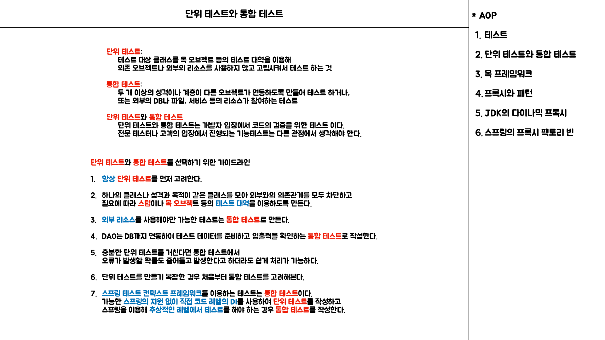

# 6. AOP

날짜: 2021년 12월 6일 → 2021년 12월 19일 속성: SR 주제: 6장 키워드: AOP, 관점 지향 프로그래밍

# AOP

## Intro

관점 지향 프로그래밍에 대한 내용을 이해해본다.

### 단위 테스트 (고립된 테스트)

> **기존에 작성했던 코드의 기능에 대해 AOP로 분리할 수 있는 부분을 확인**

- 테스트 대상의 의존 오브젝트를 파악하여 **`테스트 해야 하는 성격을 분리`**해본다.
- UserService의 기능이 동작하기 위해서 `**세 가지 기능**`이 필요하다.
    - `**데이터 접근**`에 필요한 로직인 UserDao
    - 서비스 레이어에서 DBMS의 `**트랜잭션의 관리**`를 위한 TransactionManager
    - **`메일 발송`**을 위한 MailSender

> **테스트 대상의 의존성을 최대한 줄이기 위한 목 오브젝트**

- MockMailSender라는 목 오브젝트를 통해 메일 발송 테스트하는 경우

- MockUserDao라는 목 오브젝트를 통해 데이터 수정 테스트 하는 경우

### 단위 테스트와 통합 테스트

단위 테스트와 통합 테스트를 작성하는 목적과 방식에 대해서 주의 깊게 살펴보아야 한다.

> **통합 테스트를 단위 테스트로 작성을 돕는 목 프레임워크**

- 두 가지 이상의 성격을 갖는 코드를 테스트 하기 위해서는 필히 통합 테스트로 작성해야 하나 목 프레임워크를 통해 단위 테스트로 작성할 수 있다.

### 프록시와 패턴

> **프록시와 사용 목적에 따른 패턴구분**

> **다이나믹 프록시**

- 기본적인 다이나믹 프록시의 동작방식

- 다이나믹 프록시 생성

- JDK 다이나믹 프록시와 스프링 ProxyFactoryBean의 구분

### 스프링 AOP

> AOP의 흐름

- 트랜잭션 서비스 추상화

- 프록시와 데코레이터 패턴
- 다이나믹 프록시와 프록시 팩토리 빈
- 자동 프록시 생성 방법과 포인트컷
- 부가기능의 모듈화

> AOP 적용 기술

- 프록시를 이용한 AOP
- 바이트코드 생성과 조작을 통한 AOP

### 트랜잭션 속성

- 트랜잭션 전파
    - PROPAGATION_REQUIRED
    - PROPAGATION_REQUIRES_NEW
    - PROPAGATION_NOT_SUPPORTED
    - ISOLATION_SERIALIZABLE

### 어노테이션 트랜잭션 속성과 포인트컷

### 트랜잭션 지원 테스트
